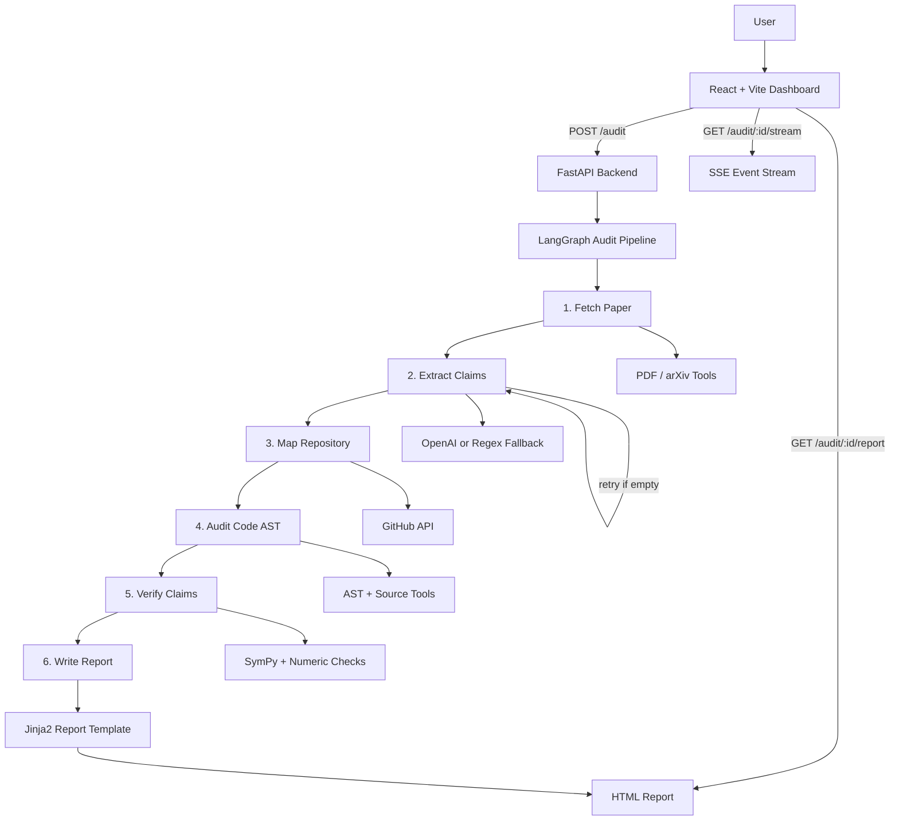

# Repro-Agent


Repro-Agent is an autonomous scientific reproducibility auditor built for the FAR AWAY 2026 Agentic & Autonomous Systems track. It accepts a research paper and a GitHub repository, extracts scientific claims, maps them to source code evidence, verifies implementation details, and generates a transparent reproducibility report.

## Features

- 🤖 Six-node autonomous audit pipeline powered by LangGraph.
- 📄 Paper ingestion from arXiv IDs or paper URLs.
- 🧠 OpenAI-powered mathematical and scientific claim extraction.
- 📴 Offline regex fallback when no OpenAI API key is available.
- 🔎 GitHub repository mapping with relevance-based Python file selection.
- 🧩 AST-first code auditing for functions, constants, and implementation evidence.
- ✅ Deterministic verification for numeric hyperparameters and symbolic expressions.
- 📡 Server-Sent Events (SSE) stream for live pipeline progress.
- 📊 React dashboard with audit modes, status badges, score cards, and report links.
- 📝 HTML reproducibility reports generated from audit results.
- 🧪 Unit tests for verifier and math equivalence behavior.

## Tech Stack

| Layer | Technologies |
| --- | --- |
| Backend | Python, FastAPI, Pydantic, Uvicorn |
| Agent Workflow | LangGraph |
| AI / LLM | OpenAI Responses API |
| Repository Access | PyGithub |
| PDF / Paper Tools | pdfplumber, pypdf, arxiv, optional pdf2image + pytesseract |
| Verification | Python AST, SymPy, numeric matching |
| Frontend | React, Vite, JavaScript, CSS |
| Streaming | Server-Sent Events with `sse-starlette` |
| Storage | In-memory audit state, SQLite config placeholder |
| Testing | Pytest |

## Architecture



## Installation

### Prerequisites

- Python 3.11 or newer
- Node.js 18 or newer
- npm
- GitHub token with repository read access
- OpenAI API key for full claim extraction

### Backend setup

```bash
git clone https://github.com/Ajey95/Faraway26.git
cd Faraway26

python -m venv .venv
```

Activate the virtual environment:

```bash
# Windows PowerShell
.\.venv\Scripts\Activate.ps1

# macOS / Linux
source .venv/bin/activate
```

Install Python dependencies:

```bash
pip install -r requirements.txt
```

Create your local environment file:

```bash
cp .env.example .env
```

### Frontend setup

```bash
cd frontend
npm install
```

## Usage

Start the backend API from the project root:

```bash
uvicorn backend.main:app --reload
```

The API will run at:

```text
http://localhost:8000
```

Start the frontend in a second terminal:

```bash
cd frontend
npm run dev
```

Open the app in your browser:

```text
http://localhost:5173
```

To run an audit:

1. Enter a paper URL or arXiv ID, such as `arxiv:1706.03762`.
2. Enter a GitHub repository URL, such as `https://github.com/tensorflow/tensor2tensor`.
3. Choose an audit mode: `quick`, `deep`, or `full`.
4. Click **Start Autonomous Audit**.
5. Watch live pipeline events and open the generated HTML report when complete.

## Project Structure

```text
.
├── backend/
│   ├── agents/
│   │   ├── graph.py                 # LangGraph workflow definition
│   │   ├── state.py                 # Audit state and dataclasses
│   │   └── nodes/                   # Six audit pipeline nodes
│   ├── api/
│   │   ├── routes.py                # FastAPI routes and SSE streaming
│   │   └── schemas.py               # Pydantic request/response models
│   ├── templates/
│   │   └── report.html.j2           # HTML report template
│   ├── tools/                       # PDF, GitHub, AST, math, metadata tools
│   └── main.py                      # FastAPI app entry point
├── frontend/
│   ├── src/
│   │   ├── components/              # Audit form, pipeline, report viewer
│   │   ├── hooks/                   # SSE hook
│   │   ├── api.js                   # Frontend API helpers
│   │   └── App.jsx                  # Main React app
│   ├── package.json
│   └── vite.config.js
├── tests/                           # Pytest verifier tests
├── requirements.txt                 # Python dependencies
├── .env.example                     # Environment variable template
└── REPRO_AGENT_FAR_AWAY_2026_PRD.md # Product requirements and design notes
```

## Screenshots

Add screenshots after running the application locally:

| Dashboard | Live Pipeline |
| --- | --- |
|  |  |

| Report View | Audit Form |
| --- | --- |
|  |  |

## API Endpoints

| Method | Endpoint | Description |
| --- | --- | --- |
| `GET` | `/health` | Health check for the backend service. |
| `POST` | `/audit` | Creates a new audit and starts the autonomous pipeline. |
| `GET` | `/audit/{audit_id}` | Returns the current audit result and status. |
| `GET` | `/audit/{audit_id}/stream` | Streams live audit events through SSE. |
| `GET` | `/audit/{audit_id}/report` | Returns the generated HTML report. |
| `GET` | `/audits` | Lists audits stored in the current backend process. |

Example audit request:

```json
{
  "paper_url": "arxiv:1706.03762",
  "repo_url": "https://github.com/tensorflow/tensor2tensor",
  "audit_mode": "deep"
}
```

## Configuration

Create a `.env` file from `.env.example` and fill in your local values.

| Variable | Required | Description |
| --- | --- | --- |
| `OPENAI_API_KEY` | Recommended | Enables OpenAI claim extraction. If omitted, regex fallback is used. |
| `OPENAI_MODEL` | Optional | Model used for claim extraction. Default: `gpt-4.1`. |
| `GITHUB_TOKEN` | Recommended | GitHub API token for reading repository files. |
| `DATABASE_URL` | Optional | Database connection string placeholder. Default uses local SQLite. |
| `CORS_ORIGINS` | Optional | Allowed frontend origins. Default: `http://localhost:5173`. |
| `CORS_ORIGIN_REGEX` | Optional | Regex for allowed hosted frontend origins, for example Vercel preview URLs. |
| `VITE_API_BASE` | Optional | Frontend API base URL. Default: `http://localhost:8000`. |

Do not commit your `.env` file or real API keys.

## Contributing

Contributions are welcome. To contribute:

1. Fork the repository.
2. Create a feature branch.
3. Make a focused change with clear commits.
4. Run backend tests with `pytest`.
5. Run the frontend build with `npm run build`.
6. Open a pull request with a short summary and screenshots when UI changes are included.

## Future Enhancements

- Add persistent database storage for audit history.
- Add richer claim-level report cards with paper snippets and code citations.
- Add cached demo fixtures for fast PASS / FAIL presentations.
- Add authentication and user-specific audit dashboards.
- Add CI workflows for backend tests and frontend builds.
- Add Docker Compose for one-command local setup.
- Expand verification beyond Python source files.
- Improve OCR support for scanned PDFs.

## License

This project is intended for open-source use. Add a `LICENSE` file to define the final license terms.

Suggested license: MIT License.

## Author

**Ajey95**

- GitHub: [@Ajey95](https://github.com/Ajey95)
- Repository: [Ajey95/Faraway26](https://github.com/Ajey95/Faraway26)
