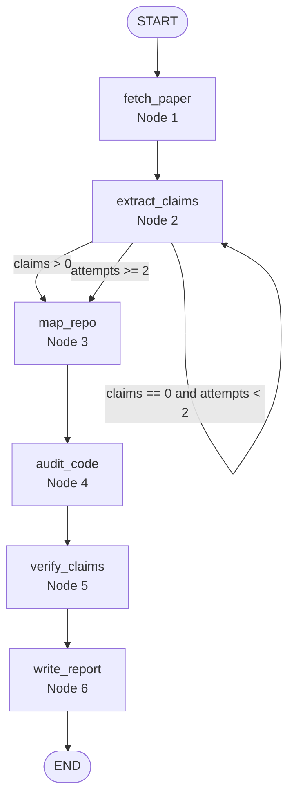

# Repro-Agent

Autonomous scientific reproducibility auditor for the FAR AWAY 2026 Agentic & Autonomous Systems track.

## Quick start

```bash
python -m venv .venv && source .venv/bin/activate
pip install -r requirements.txt
cp .env.example .env
# Edit .env and add OPENAI_API_KEY plus GITHUB_TOKEN
uvicorn backend.main:app --reload
```

In a second terminal:

```bash
cd frontend
npm install
npm run dev
```

## Architecture



## Frontend UI and UX

The frontend is a lightweight React + Vite single-page app designed to make the autonomous audit pipeline feel observable rather than opaque. The current interface is intentionally minimal, but it establishes the UX structure for the full hackathon demo:

### Screen layout

1. **Hero / product context**
   - The page opens with the Repro-Agent name and a short description so users immediately understand that the tool audits scientific reproducibility rather than acting as a generic chatbot.
   - The copy frames the experience as an autonomous pipeline that runs after the user submits a paper and repository pair.

2. **Audit form**
   - The first interactive section asks for two inputs:
     - a paper URL or arXiv ID, prefilled with `arxiv:1706.03762`
     - a GitHub repository URL, prefilled with `https://github.com/tensorflow/tensor2tensor`
   - The prefilled values are chosen to support a fast demo path: users can click **Start audit** without hunting for sample data.
   - The form is intentionally direct and avoids advanced settings so first-time users can understand the primary workflow in one glance.

3. **Report summary panel**
   - After an audit starts, the UI shows the audit's current pipeline node and reproducibility score.
   - A report link opens the backend-generated HTML report in a new tab, separating the live monitoring workflow from the final shareable artifact.

4. **Live pipeline timeline**
   - The UI subscribes to the backend SSE stream for the active audit.
   - Each pipeline event is appended to an ordered list, giving users a real-time audit trail as the system fetches the paper, extracts claims, maps the repo, audits code, verifies claims, and writes the report.
   - This timeline is the core agentic UX element: it makes the system's autonomous decisions visible step by step.

### Component map

- `frontend/src/App.jsx` owns top-level page state, starts audits, wires the SSE hook, and composes the form, report panel, and live pipeline timeline.
- `frontend/src/components/AuditForm.jsx` contains the paper/repository input form and demo-friendly defaults.
- `frontend/src/components/ReportViewer.jsx` displays the current audit node, score, and report link.
- `frontend/src/components/LivePipeline.jsx` renders streaming backend events as a chronological timeline.
- `frontend/src/hooks/useSSE.js` manages the EventSource connection and listens for named pipeline events.
- `frontend/src/api.js` centralizes backend API URLs and request helpers.

### Visual design direction

- The current styling uses a clean card-based layout on a soft background, with high-contrast primary actions and rounded sections to keep the demo readable on a projector.
- Form fields are stacked vertically to reduce cognitive load and make the two required inputs obvious.
- The live event panel favors transparency over polish at this stage by showing raw event payloads; a follow-up UI pass should convert these payloads into human-readable step cards with status icons, durations, and claim counts.

### Planned UX improvements

- Replace raw JSON event rows with a polished six-step pipeline tracker.
- Add pass/fail/partial color badges for claim verdicts.
- Add expandable claim cards with paper text, code snippet, file/line citation, discrepancy explanation, and verification confidence.
- Add demo preset buttons for known PASS and FAIL scenarios.
- Add loading, error, empty-state, and retry affordances around SSE disconnects and backend failures.
- Add a score ring and downloadable report button in the report panel.

## Current implementation status

This repository now contains a runnable starter implementation of the PRD:

- FastAPI backend with audit creation, polling, SSE streaming, and HTML report endpoints.
- LangGraph pipeline with the six PRD nodes and retry routing for claim extraction.
- AST-first Python source scanning for functions and constants.
- GitHub repository mapping through PyGithub.
- React/Vite frontend for launching audits and watching pipeline events.

The verifier currently emits conservative `partial` / `not_found` verdicts; full symbolic paper-to-code expression mapping is the next major milestone.
